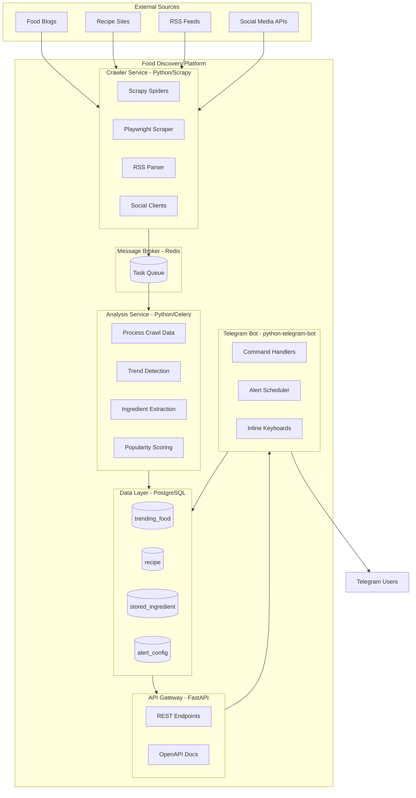
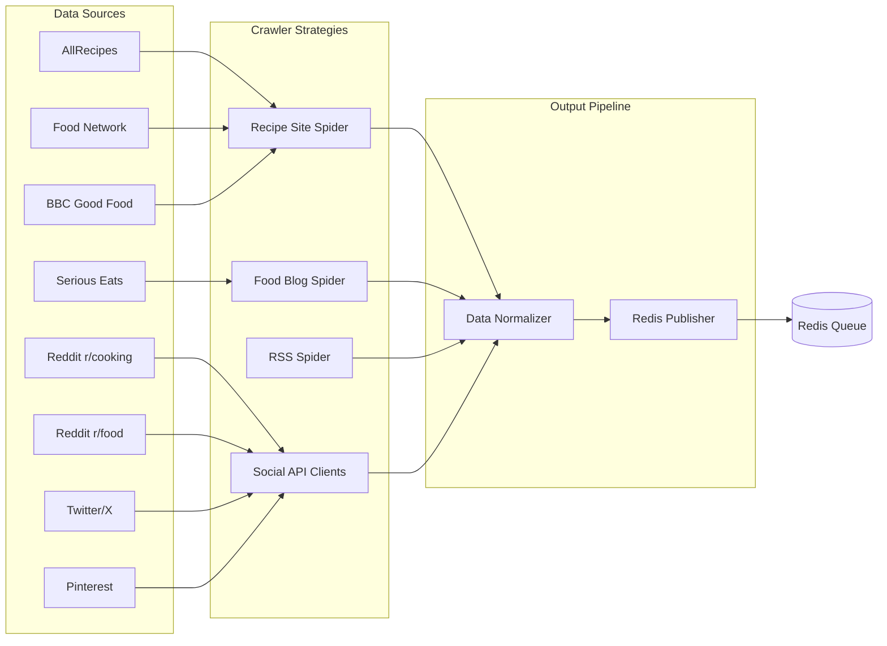
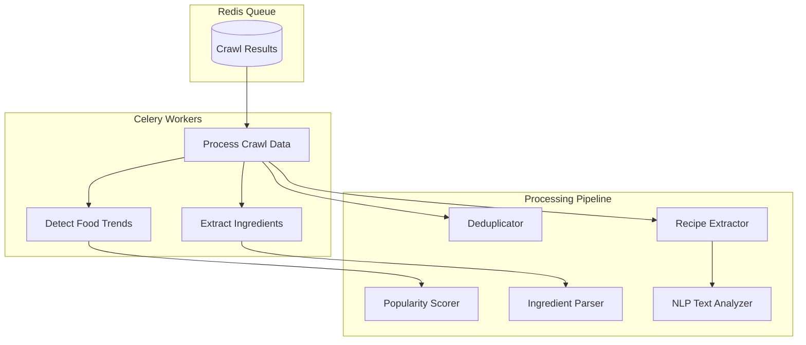
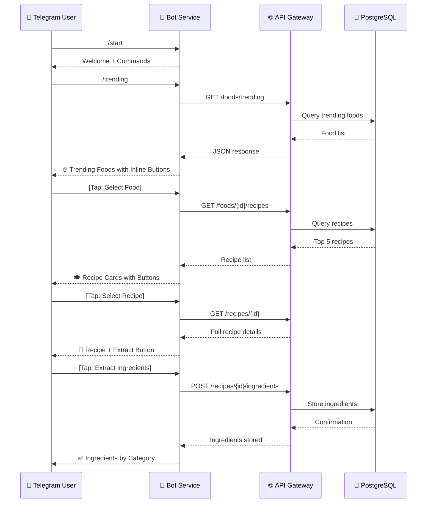
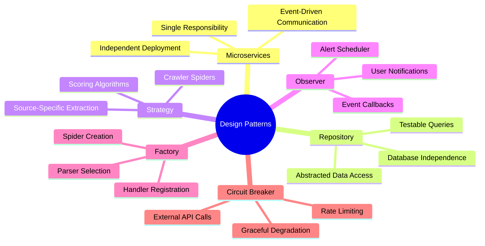
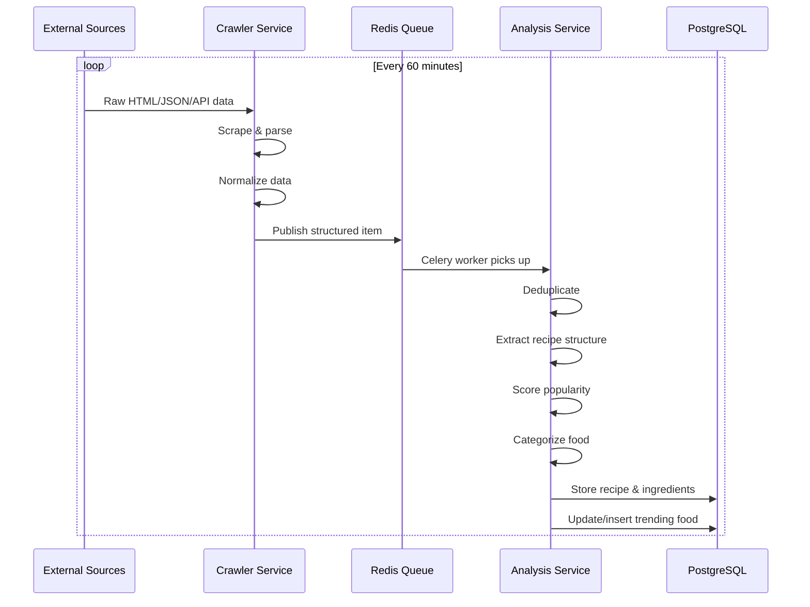
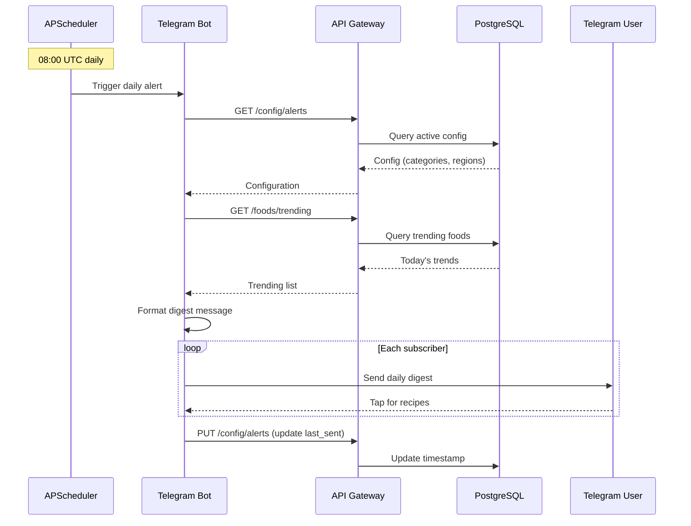
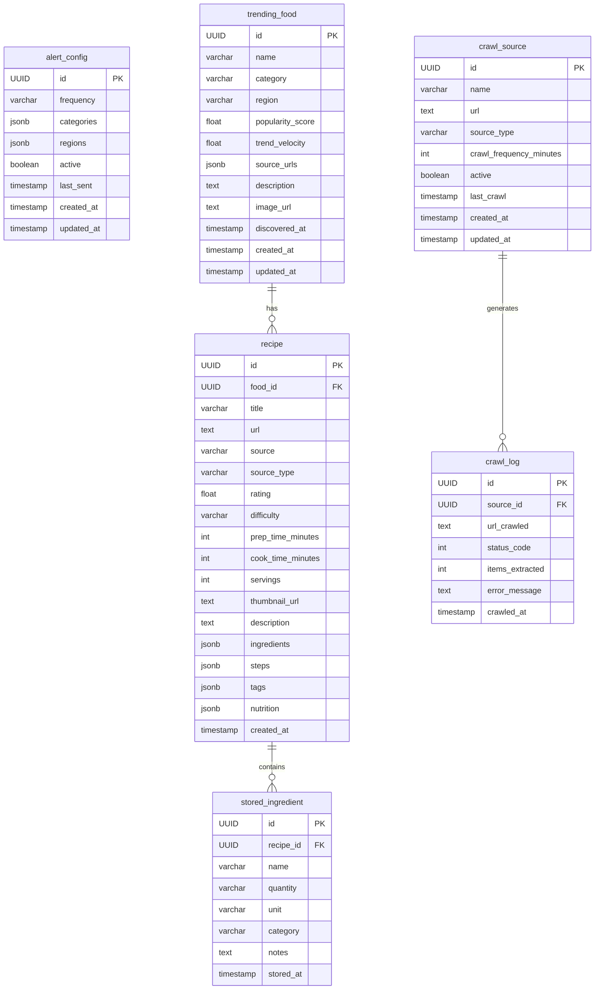

# Food Discovery Platform

A container-based microservices platform that monitors food & lifestyle feeds across websites, social media, blogs, and viral recipe aggregators to identify trending foods and recipes. Delivers daily alerts via Telegram bot with configurable categories, regions, and frequencies.

## Architecture Overview



## System Components

### 1. Crawler Service (`crawler-service/`)

Multi-source data collection from food & lifestyle platforms.



**Spiders**:
- `recipe_site_spider.py` - Structured recipe data from AllRecipes, Food Network, BBC Good Food, Tasty
- `blog_spider.py` - Food blog extraction (Serious Eats, Bon Appetit, Epicurious, Food52)
- `rss_spider.py` - RSS feed monitoring (feedparser-based)
- `dynamic_scraper.py` - Playwright for JavaScript-heavy sites
- `reddit_client.py` - Reddit API integration (r/cooking, r/food, r/recipes)
- `pinterest_client.py` - Pinterest API trending pins
- `twitter_client.py` - Twitter/X API trending hashtags

### 2. Analysis Service (`analysis-service/`)

Processes raw crawled data through Celery workers.



**Trend Scoring Algorithm**:
```
score = (frequency_weight × 0.4) + (velocity_weight × 0.3) + 
        (source_diversity × 0.2) + (engagement × 0.1)
```

### 3. API Gateway (`api-gateway/`)

FastAPI-based REST API with auto-generated OpenAPI documentation.

```mermaid
graph LR
    subgraph Endpoints["API Endpoints"]
        A["/api/v1/config/alerts"]
        B[/api/v1/foods/trending]
        C[/api/v1/foods/{id}/recipes]
        D[/api/v1/recipes/{id}]
        E[/api/v1/recipes/{id}/ingredients]
        F[/api/v1/categories]
        G[/api/v1/regions]
        H[/api/v1/crawler/status]
        I[/api/v1/analysis/status]
    end

    subgraph Services["Service Layer"]
        J[Config Service]
        K[Food Service]
        L[Recipe Service]
        M[Ingredient Service]
    end

    subgraph Data["Data Layer"]
        N[(PostgreSQL)]
    end

    A --> J
    B --> K
    C --> L
    D --> L
    E --> M
    F --> J
    G --> J
    H --> K
    I --> K

    J --> N
    K --> N
    L --> N
    M --> N
```

**Endpoints**:

| Method | Endpoint | Description |
|--------|----------|-------------|
| GET | `/health` | Health check |
| GET | `/api/v1/config/alerts` | Get alert configuration |
| PUT | `/api/v1/config/alerts` | Update alert configuration |
| GET | `/api/v1/config/alerts/all` | List all configurations |
| GET | `/api/v1/foods/trending` | Get trending foods |
| GET | `/api/v1/foods/{id}/recipes` | Get top 5 recipes for food |
| GET | `/api/v1/recipes/{id}` | Get recipe details |
| POST | `/api/v1/recipes/{id}/ingredients` | Extract & store ingredients |
| GET | `/api/v1/recipes/{id}/ingredients` | Get stored ingredients |
| GET | `/api/v1/categories` | List food categories |
| GET | `/api/v1/regions` | List cuisine regions |
| GET | `/api/v1/crawler/status` | Get crawler status |
| GET | `/api/v1/analysis/status` | Get analysis status |

### 4. Telegram Bot (`telegram-bot/`)

User interaction interface with command-based navigation and inline keyboards.



**Bot Commands**:

| Command | Description |
|---------|-------------|
| `/start` | Initialize bot with welcome message |
| `/help` | Show all available commands |
| `/categories` | Select food categories via inline keyboard |
| `/regions` | Select cuisine regions via inline keyboard |
| `/trending` | Get current trending foods |
| `/trending <category>` | Filter trending by category |
| `/recipes <food_name>` | Get top 5 recipes for a food |
| `/ingredients <recipe_id>` | Extract and store ingredients |
| `/configure` | Configure alert preferences |
| `/status` | View system status |

## Design Patterns



| Pattern | Location | Implementation |
|---------|----------|----------------|
| **Microservices** | Overall architecture | 6 independent services in Docker containers |
| **Event-Driven** | Crawler → Analysis | Redis queue, Celery workers |
| **Repository** | Data layer | `BaseRepository<T>` with SQLAlchemy |
| **Strategy** | Crawler module | Different spider class per source type |
| **Observer** | Telegram notifications | APScheduler, callback handlers |
| **Factory** | Component creation | Crawler process, bot handlers |
| **Circuit Breaker** | External APIs | Try/except with fallback values |

## Data Flow

### Data Ingestion Pipeline



### Daily Alert Flow



## Database Schema



## Directory Structure

```
food-discovery-platform/
├── docker-compose.yml          # All services, networks, volumes
├── .env.example                # Environment variables template
├── api-gateway/                # FastAPI REST API
│   ├── Dockerfile
│   ├── requirements.txt
│   └── app/
│       ├── main.py             # FastAPI entry point
│       ├── config.py           # Pydantic settings
│       ├── database.py         # SQLAlchemy async setup
│       ├── models/             # ORM models
│       ├── repositories/       # Data access layer
│       ├── routers/            # API endpoints
│       ├── schemas/            # Pydantic schemas (OAS)
│       └── middleware/         # Rate limiter
├── crawler-service/            # Scrapy + Playwright
│   ├── Dockerfile
│   ├── requirements.txt
│   └── crawler/
│       ├── settings.py         # Scrapy configuration
│       ├── runner.py           # Entry point
│       ├── spiders/            # Scrapy spiders
│       ├── playwright/         # Dynamic scraper
│       ├── social/             # API clients
│       ├── pipelines/          # Data processing
│       └── middlewares/        # Rate limiting
├── analysis-service/           # Celery workers
│   ├── Dockerfile
│   ├── requirements.txt
│   └── analysis/
│       ├── celery_app.py       # Celery configuration
│       ├── tasks/              # Background tasks
│       ├── processors/         # Business logic
│       └── nlp/               # Text analysis
├── telegram-bot/               # User interface
│   ├── Dockerfile
│   ├── requirements.txt
│   └── bot/
│       ├── main.py             # Entry point
│       ├── handlers/           # Command & callback handlers
│       ├── keyboards/          # Inline keyboard builders
│       ├── scheduler/          # Daily alert cron
│       └── formatters/         # Message formatting
├── database/
│   └── init.sql                # Schema + seed data
├── postman/
│   └── food-discovery-api.postman_collection.json
└── docs/
    └── api-reference.md
```

## Quick Start

### Prerequisites

- Docker & Docker Compose
- Telegram Bot Token (from [@BotFather](https://t.me/botfather))

### Setup

1. **Clone and configure**:
```bash
git clone <repo-url> food-discovery-platform
cd food-discovery-platform
cp .env.example .env
```

2. **Set your Telegram Bot Token** in `.env`:
```env
TELEGRAM_BOT_TOKEN=your_actual_bot_token_here
```

3. **Launch all services**:
```bash
docker-compose up --build
```

4. **Verify**:
- API Gateway: http://localhost:8000/docs (Swagger UI)
- Health Check: http://localhost:8000/health
- Start Telegram bot: https://t.me/your_bot_username

### Running without Docker

Each service can run independently:

```bash
# API Gateway
cd api-gateway
pip install -r requirements.txt
uvicorn app.main:app --reload --port 8000

# Analysis Service
cd analysis-service
pip install -r requirements.txt
celery -A analysis.celery_app worker --loglevel=info

# Crawler Service
cd crawler-service
pip install -r requirements.txt
python -m crawler.runner

# Telegram Bot
cd telegram-bot
pip install -r requirements.txt
python -m bot.main
```

## API Documentation

Auto-generated Swagger UI is available at `http://localhost:8000/docs` when the API Gateway is running.

The OpenAPI specification includes all endpoints with request/response schemas, example values, and error codes.

## Telegram Bot Usage

### Command Examples

```
/start         → Welcome message with setup options
/categories    → Inline keyboard: 🍰 Desserts, 🥗 Starters, 🍛 Main Course...
/regions       → Inline keyboard: 🇮🇳 Indian, 🌏 South Asian, 🌮 Mexican...
/trending      → "🔥 Today's Trending Foods: 1. Tiramisu (92/100)..."
/trending desserts → Filter by category
/recipes tiramisu  → "🍽️ Top 5 Tiramisu Recipes: 1. Classic Italian ⭐⭐⭐⭐..."
/ingredients <id>  → "✅ Ingredients Stored: Mascarpone 500g, Eggs 3..."
```

### Alert Configuration

Configure via `/configure` command:
- **Frequency**: hourly, daily, weekly
- **Categories**: desserts, starters, main-course, baking, beverages, snacks
- **Regions**: indian, south-asian, mexican, italian, east-asian, mediterranean, global

Daily alerts are sent at **08:00 UTC** with trending foods and recipe recommendations.

## Postman Testing

Import `postman/food-discovery-api.postman_collection.json` into Postman.

Set environment variables:
| Variable | Value |
|----------|-------|
| `base_url` | `http://localhost:8000` |
| `food_id` | (auto-populated from first request) |
| `recipe_id` | (auto-populated from first request) |

### Test Cases Included

- Health check
- CRUD operations for alert configuration
- Category and region listing
- Trending food queries with filters
- Recipe retrieval and details
- Ingredient extraction and storage
- Error handling (404, invalid params)
- System status endpoints

## Technologies

| Component | Technology | Purpose |
|-----------|------------|---------|
| API Framework | FastAPI 0.104+ | REST API with auto OpenAPI |
| ORM | SQLAlchemy 2.0+ | Async database access |
| Database | PostgreSQL 15 | Primary data store |
| Message Queue | Redis 7 | Task queue + caching |
| Crawler | Scrapy 2.11+ | Structured web scraping |
| Dynamic Scraping | Playwright | JavaScript-heavy sites |
| Task Queue | Celery 5.3+ | Async processing |
| NLP | spaCy 3.7+ | Text analysis |
| Bot Framework | python-telegram-bot 20+ | Telegram integration |
| Container | Docker + Compose | Deployment |
| Data Formats | JSONB | Flexible ingredient storage |

## Contributing

1. Fork the repository
2. Create a feature branch
3. Run tests: `docker-compose up` and verify endpoints
4. Submit a pull request

## License

MIT License - See LICENSE file for details.
