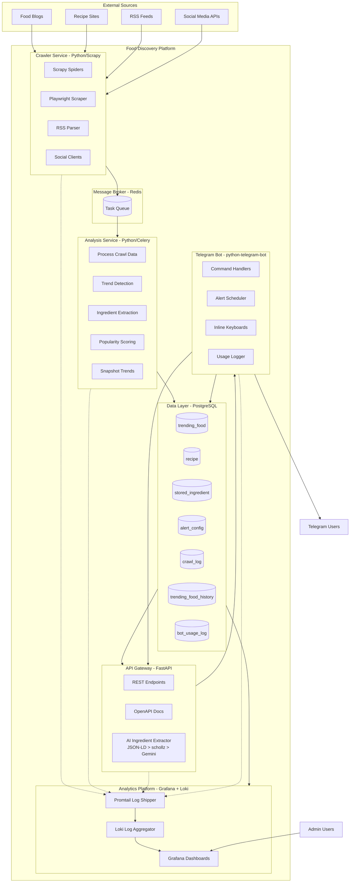
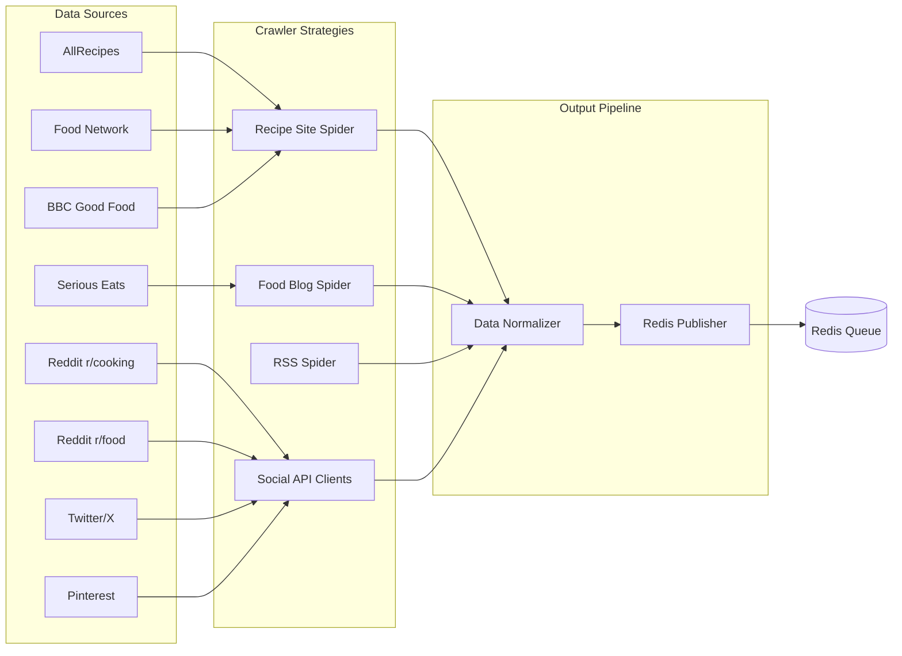
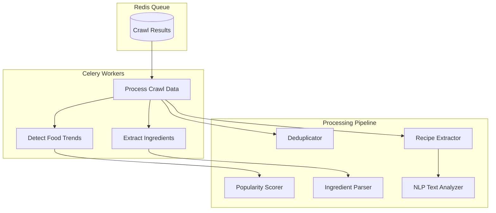
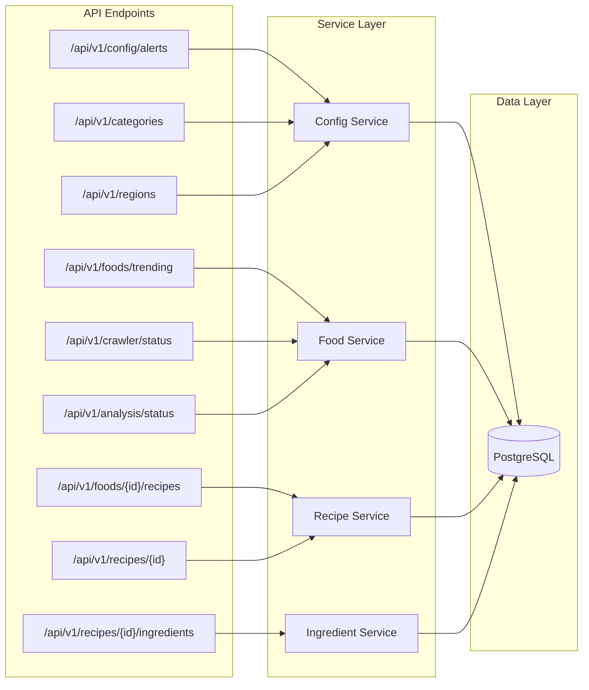
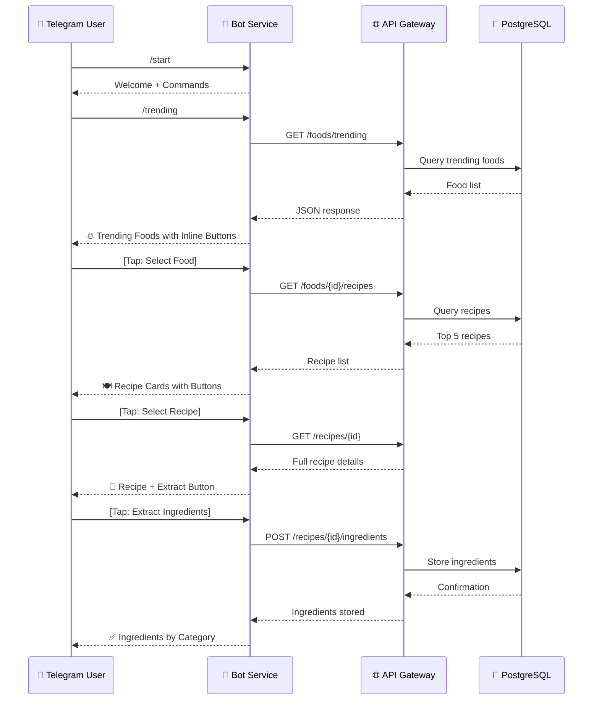
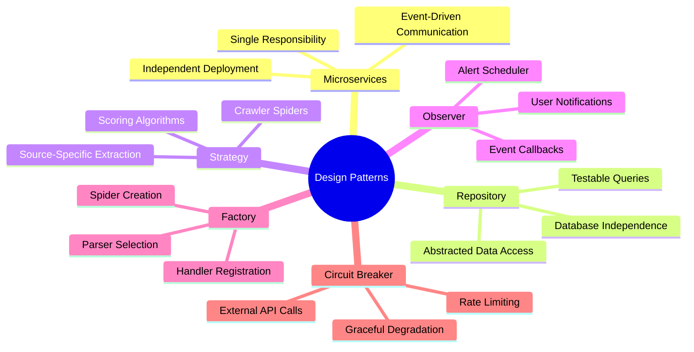
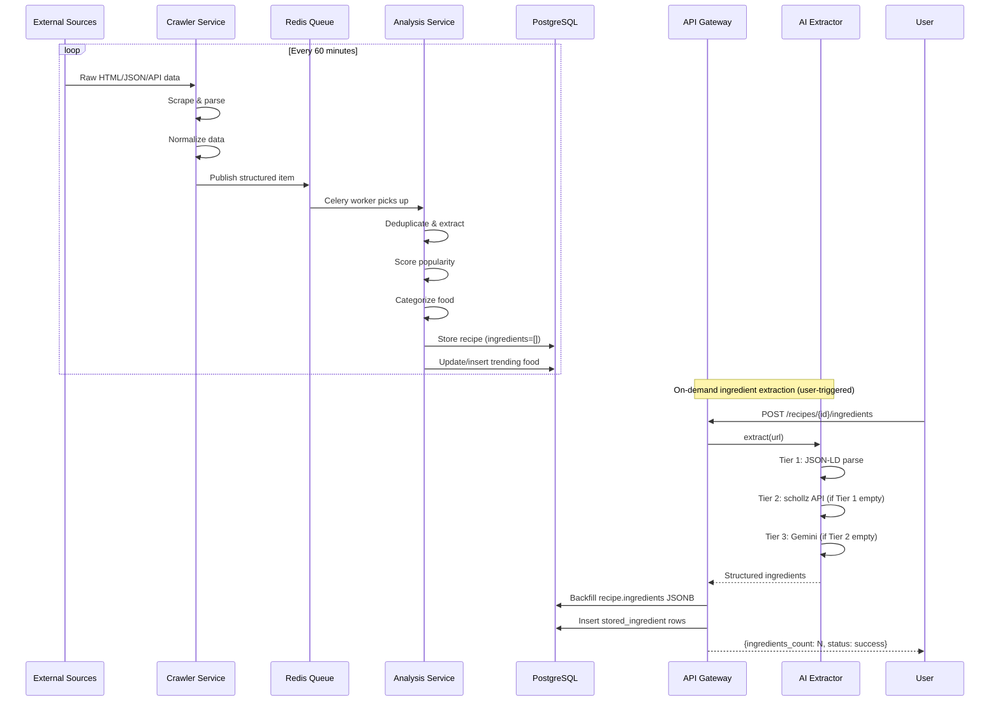
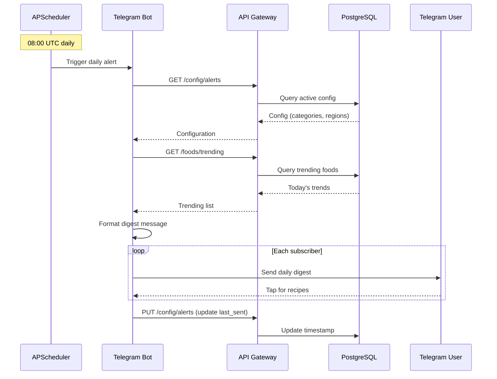
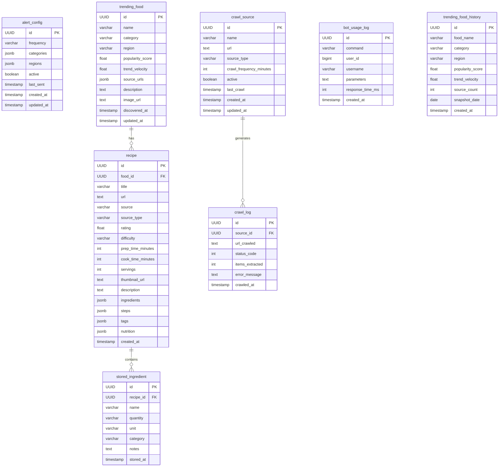
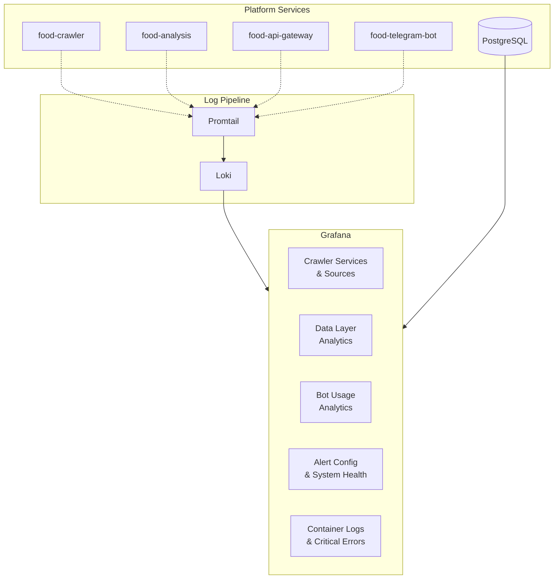

# Food Discovery Platform

A container-based microservices platform that monitors food & lifestyle feeds across websites, social media, blogs, and viral recipe aggregators to identify trending foods and recipes. Delivers daily alerts via Telegram bot with configurable categories, regions, and frequencies.

**Current Status**: 10 containers operational across 8 services. 343+ recipes indexed, 59+ ingredients extracted via AI, 23 trending foods tracked.

## Architecture Overview



## System Components

### 1. Crawler Service (`crawler-service/`)

Multi-source data collection from food & lifestyle platforms, employing three crawling strategies: static Scrapy spiders, Playwright-based dynamic rendering, and social API clients.



**Spiders & Clients**:
- `recipe_site_spider.py` - Structured recipe data from AllRecipes, Food Network, BBC Good Food, Tasty, Serious Eats
- `blog_spider.py` - Food blog extraction (Serious Eats, Bon Appetit, Epicurious, Food52)
- `rss_spider.py` - RSS feed monitoring (feedparser-based)
- `dynamic_scraper.py` - Standalone Playwright for JavaScript-heavy sites (Serious Eats) with listing & batch methods
- `reddit_client.py` - Reddit API integration (r/cooking, r/food, r/recipes)

**Crawler Optimizations**:
- `RandomUserAgentMiddleware` - Rotates User-Agent per request via `fake-useragent` to avoid bot detection
- `RateLimitMiddleware` - Non-blocking per-domain rate limiting using `twisted.internet.reactor.callLater()` instead of `time.sleep()`
- `ROBOTSTXT_OBEY = False` across all spiders for production crawling
- Playwright fallback in `blog_spider` and `rss_spider` when static extraction yields no ingredients

### 2. Analysis Service (`analysis-service/`)

Processes raw crawled data through Celery workers.



**Trend Scoring Algorithm**:
```
score = (frequency_weight × 0.4) + (velocity_weight × 0.3) + 
        (source_diversity × 0.2) + (engagement × 0.1)
```

### 3. API Gateway (`api-gateway/`)

FastAPI-based REST API with auto-generated OpenAPI documentation and on-demand AI ingredient extraction.

#### AI Ingredient Extractor

A three-tier cascading extractor that parses unstructured recipe pages into structured ingredient data. Runs synchronously on-demand when users call `POST /api/v1/recipes/{id}/ingredients`.

| Tier | Method | Coverage | Dependency |
|------|--------|----------|------------|
| **Tier 1** | JSON-LD (BeautifulSoup + lxml) | ~95% of recipe sites | None (built-in) |
| **Tier 2** | schollz/ingredients free API | ~4% (sites without schema) | None (free API) |
| **Tier 3** | Google Gemini 2.0 Flash | ~1% (fallback) | `GEMINI_API_KEY` in `.env` |

The extractor backfills `recipe.ingredients` JSONB on first access. Subsequent calls return cached data. All three tiers require no paid dependencies unless Gemini is explicitly configured.



**Endpoints**:

| Method | Endpoint | Description |
|--------|----------|-------------|
| GET | `/health` | Health check |
| GET | `/api/v1/config/alerts` | Get alert configuration |
| PUT | `/api/v1/config/alerts` | Update alert configuration |
| GET | `/api/v1/config/alerts/all` | List all configurations |
| GET | `/api/v1/foods/trending` | Get trending foods |
| GET | `/api/v1/foods/{id}/recipes` | Get top 5 recipes for food |
| GET | `/api/v1/recipes/{id}` | Get recipe details |
| POST | `/api/v1/recipes/{id}/ingredients` | Extract & store ingredients |
| GET | `/api/v1/recipes/{id}/ingredients` | Get stored ingredients |
| GET | `/api/v1/categories` | List food categories |
| GET | `/api/v1/regions` | List cuisine regions |
| GET | `/api/v1/crawler/status` | Get crawler status |
| GET | `/api/v1/analysis/status` | Get analysis status |
| GET | `/api/v1/analytics/crawler/summary` | Crawler source summary with stats |
| GET | `/api/v1/analytics/data/summary` | Data layer aggregate counts |
| GET | `/api/v1/analytics/bot/usage` | Bot command usage statistics |
| POST | `/api/v1/analytics/bot/log` | Log a bot command usage event |
| GET | `/api/v1/analytics/config/summary` | Current alert configuration summary |

### 4. Telegram Bot (`telegram-bot/`)

User interaction interface with command-based navigation and inline keyboards.



**Bot Commands**:

| Command | Description |
|---------|-------------|
| `/start` | Initialize bot with welcome message |
| `/help` | Show all available commands |
| `/categories` | Select food categories via inline keyboard |
| `/regions` | Select cuisine regions via inline keyboard |
| `/foods <category>` | Browse foods by category with inline keyboard |
| `/trending` | Get current trending foods |
| `/trending <category>` | Filter trending by category |
| `/recipes <food_name>` | Get top 5 recipes for a food |
| `/ingredients <recipe_id>` | Extract and store ingredients |
| `/configure` | Configure alert preferences |
| `/status` | View system status |

## Design Patterns



| Pattern | Location | Implementation |
|---------|----------|----------------|
| **Microservices** | Overall architecture | 6 independent services in Docker containers |
| **Event-Driven** | Crawler → Analysis | Redis queue, Celery workers |
| **Repository** | Data layer | `BaseRepository<T>` with SQLAlchemy |
| **Strategy** | Crawler module | Different spider class per source type |
| **Observer** | Telegram notifications | APScheduler, callback handlers |
| **Factory** | Component creation | Crawler process, bot handlers |
| **Circuit Breaker** | External APIs | Try/except with fallback values |

## Data Flow

### Data Ingestion Pipeline



### Daily Alert Flow



## Database Schema



## Directory Structure

```
food-discovery-platform/
├── docker-compose.yml          # All services, networks, volumes
├── .env.example                # Environment variables template
├── api-gateway/                # FastAPI REST API
│   ├── Dockerfile
│   ├── requirements.txt
│   └── app/
│       ├── main.py             # FastAPI entry point
│       ├── config.py           # Pydantic settings
│       ├── database.py         # SQLAlchemy async setup
│       ├── models/             # ORM models
│       ├── repositories/       # Data access layer
│       ├── routers/            # API endpoints
│       ├── schemas/            # Pydantic schemas (OAS)
│       ├── services/           # AI ingredient extractor (3-tier)
│       └── middleware/         # Rate limiter
├── crawler-service/            # Scrapy + Playwright
│   ├── Dockerfile
│   ├── requirements.txt
│   └── crawler/
│       ├── settings.py         # Scrapy configuration
│       ├── runner.py           # Entry point
│       ├── spiders/            # Scrapy spiders
│       ├── playwright/         # Dynamic scraper
│       ├── social/             # API clients
│       ├── pipelines/          # Data processing
│       └── middlewares/        # Rate limiting, User-Agent rotation
├── analysis-service/           # Celery workers
│   ├── Dockerfile
│   ├── requirements.txt
│   └── analysis/
│       ├── celery_app.py       # Celery configuration
│       ├── tasks/              # Background tasks
│       ├── processors/         # Business logic
│       └── nlp/               # Text analysis
├── telegram-bot/               # User interface
│   ├── Dockerfile
│   ├── requirements.txt
│   └── bot/
│       ├── main.py             # Entry point
│       ├── handlers/           # Command & callback handlers
│       ├── keyboards/          # Inline keyboard builders
│       ├── scheduler/          # Daily alert cron
│       └── formatters/         # Message formatting
├── grafana/                    # Analytics dashboards
│   ├── provisioning/
│   │   ├── datasources/        # Auto-configured data sources
│   │   └── dashboards/         # Dashboard provisioning config
│   └── dashboards/             # Pre-built dashboard JSON files
├── promtail/                   # Log shipping config
│   └── promtail-config.yml     # Container log scraping
├── database/
│   └── init.sql                # Schema + seed data
├── postman/
│   └── food-discovery-api.postman_collection.json
└── docs/
    └── api-reference.md
```

## Quick Start

### Prerequisites

- Docker & Docker Compose
- Telegram Bot Token (from [@BotFather](https://t.me/botfather))

### Setup

1. **Clone and configure**:
```bash
git clone <repo-url> food-discovery-platform
cd food-discovery-platform
cp .env.example .env
```

2. **Set your Telegram Bot Token** in `.env`:
```env
TELEGRAM_BOT_TOKEN=your_actual_bot_token_here
```

3. **Launch all services**:
```bash
docker-compose up --build
```

4. **Verify**:
- API Gateway: http://localhost:8001/docs (Swagger UI)
- Health Check: http://localhost:8001/health
- Grafana Dashboards: http://localhost:3000 (admin/admin)
- Start Telegram bot: https://t.me/your_bot_username

### Running without Docker

Each service can run independently:

```bash
# API Gateway
cd api-gateway
pip install -r requirements.txt
uvicorn app.main:app --reload --port 8000

# Analysis Service
cd analysis-service
pip install -r requirements.txt
celery -A analysis.celery_app worker --loglevel=info

# Crawler Service
cd crawler-service
pip install -r requirements.txt
python -m crawler.runner

# Telegram Bot
cd telegram-bot
pip install -r requirements.txt
python -m bot.main
```

## API Documentation

Auto-generated Swagger UI is available at `http://localhost:8000/docs` when the API Gateway is running.

The OpenAPI specification includes all endpoints with request/response schemas, example values, and error codes.

## Telegram Bot Usage

### Command Examples

```
/start         → Welcome message with setup options
/categories    → Inline keyboard: 🍰 Desserts, 🥗 Starters, 🍛 Main Course...
/regions       → Inline keyboard: 🇮🇳 Indian, 🌏 South Asian, 🌮 Mexican...
/trending      → "🔥 Today's Trending Foods: 1. Tiramisu (92/100)..."
/trending desserts → Filter by category
/recipes tiramisu  → "🍽️ Top 5 Tiramisu Recipes: 1. Classic Italian ⭐⭐⭐⭐..."
/ingredients <id>  → "✅ Ingredients Stored: Mascarpone 500g, Eggs 3..."
```

### Alert Configuration

Configure via `/configure` command:
- **Frequency**: hourly, daily, weekly
- **Categories**: desserts, starters, main-course, baking, beverages, snacks
- **Regions**: indian, south-asian, mexican, italian, east-asian, mediterranean, global

Daily alerts are sent at **08:00 UTC** with trending foods and recipe recommendations.

## Postman Testing

Import `postman/food-discovery-api.postman_collection.json` into Postman.

Set environment variables:
| Variable | Value |
|----------|-------|
| `base_url` | `http://localhost:8000` |
| `food_id` | (auto-populated from first request) |
| `recipe_id` | (auto-populated from first request) |

### Test Cases Included

- Health check
- CRUD operations for alert configuration
- Category and region listing
- Trending food queries with filters
- Recipe retrieval and details
- Ingredient extraction and storage
- Error handling (404, invalid params)
- System status endpoints

## Recent Bug Fixes

### AI Ingredient Extractor — Regex Unterminated Subpattern Crash
**File**: `api-gateway/app/services/ai_ingredient_extractor.py`
- **Root Cause**: The regex in `_parse_ingredient_str` had `((?:cup|cups|...)` (extra opening paren) but only `)?` (one closing paren), causing `re.error: unterminated subpattern` on every ingredient parse. The exception was silently caught by `except Exception: return None` in `_tier1_jsonld`, making it appear as if no JSON-LD data existed.
- **Fix**: Changed `)?\s*` to `))?\s*` to properly close both capturing and non-capturing groups. Also reordered unit alternation (plural before singular) for accurate matching.

### Food Network — Regex Filtered All Recipe URLs
**File**: `crawler-service/crawler/spiders/recipe_site_spider.py`
- **Root Cause**: `_is_recipe_page()` used `r'/recipe/'` which requires the literal string `/recipe/` (singular, with trailing slash). Food Network URLs use `/recipes/` (plural). All Food Network recipe links were silently dropped — zero requests reached any recipe page.
- **Fix**: Changed to `r'/(recipe|recept|recipes)/'` which matches both singular and plural forms.

### Rate Limiter — Blocking `time.sleep()` Destroyed Concurrency
**File**: `crawler-service/crawler/middlewares/rate_limiter.py`
- **Root Cause**: `time.sleep()` in a Scrapy downloader middleware blocks the entire Twisted reactor, preventing any concurrent request processing across all spiders.
- **Fix**: Replaced with `reactor.callLater(wait, callback)` returning a `Deferred`, allowing the reactor to continue processing other requests during the delay.

### User-Agent — Bot Identifier Made Crawlers Easily Blockable
**File**: `crawler-service/crawler/middlewares/user_agent.py` (new)
- **Root Cause**: The global `USER_AGENT = "FoodDiscoveryBot/1.0"` identified the crawler as a bot, causing Cloudflare and anti-bot measures to return 402/403.
- **Fix**: New `RandomUserAgentMiddleware` uses `fake-useragent` library (already in requirements.txt but unused) to rotate real browser User-Agent strings on every request. Falls back to a curated list of modern browser UAs.

### CrawlLogPipeline — Wrong Spider Name Key
**File**: `crawler-service/crawler/pipelines/crawl_logger.py`
- **Root Cause**: `SPIDER_SOURCE_MAP` had key `"blog_feeds"` but the actual spider name is `"food_blogs"`. Crawl logging silently failed for all blog spider crawls.
- **Fix**: Changed `"blog_feeds"` → `"food_blogs"` and added `Serious Eats` to `recipe_sites` map.

### Robots.txt — Inconsistent Across Spiders
**Files**: `crawler-service/crawler/settings.py`, `crawler-service/crawler/spiders/blog_spider.py`, `crawler-service/crawler/spiders/rss_spider.py`
- **Root Cause**: `ROBOTSTXT_OBEY = True` was set globally in `settings.py` but `recipe_sites` spider set `False` via `custom_settings`. The `blog_spider` and `rss_spider` inherited `True`, unnecessarily limiting their crawl scope.
- **Fix**: Set `ROBOTSTXT_OBEY = False` globally and added explicit overrides in all three spiders.

### JSON-LD — `@type` as List Not Supported
**File**: `crawler-service/crawler/spiders/recipe_site_spider.py`
- **Root Cause**: `item.get("@type") == "Recipe"` fails when `@type` is a list like `["Recipe", "CreativeWork"]` (common on modern recipe sites).
- **Fix**: Added `isinstance(atype, list) and "Recipe" in atype` check. Also searches `@graph`, `itemListElement`, `mainEntity` for nested schemas.

## Technologies

| Component | Technology | Purpose |
|-----------|------------|---------|
| API Framework | FastAPI 0.104+ | REST API with auto OpenAPI |
| ORM | SQLAlchemy 2.0+ | Async database access |
| Database | PostgreSQL 15 | Primary data store |
| Message Queue | Redis 7 | Task queue + caching |
| Crawler | Scrapy 2.11+ | Structured web scraping |
| Dynamic Scraping | Playwright + Chromium | JavaScript-heavy sites |
| Task Queue | Celery 5.3+ | Async processing |
| NLP | spaCy 3.7+ | Text analysis |
| Bot Framework | python-telegram-bot 20+ | Telegram integration |
| Container | Docker + Compose | Deployment |
| Data Formats | JSONB | Flexible ingredient storage |
| Analytics | Grafana 11 | Dashboard & visualization UI |
| Log Aggregation | Loki 3 + Promtail 3 | Container log collection & search |
| AI Tier 1 | BeautifulSoup + lxml | JSON-LD structured data extraction |
| AI Tier 2 | schollz/ingredients (free API) | Ingredient parsing fallback |
| AI Tier 3 | Google Gemini 2.0 Flash | LLM-based ingredient extraction |

## Analytics & Reporting

The platform includes a self-hosted analytics stack built on **Grafana + Loki + Promtail**, providing real-time dashboards for monitoring crawler performance, data layer metrics, bot usage, alert configuration, and container logs.

### Architecture



### Accessing Grafana

| Item | Details |
|------|---------|
| **URL** | http://localhost:3000 |
| **Default User** | `admin` |
| **Default Password** | `admin` |

> **Security Note**: Change the default credentials in production via `GF_SECURITY_ADMIN_PASSWORD` in `docker-compose.yml`.

### Pre-Built Dashboards

#### 1. Crawler Services & Sources
Monitors all active crawl sources, their performance, and error rates.
- Active/Total source counters
- Items extracted over time (7-day time series)
- Error rate by source (bar chart)
- Last crawl per source (table with timestamps)
- Total crawls and items per source

#### 2. Data Layer Analytics
Provides aggregate views of all stored data across the PostgreSQL database.
- Total trending foods, recipes, stored ingredients, and crawl logs
- Foods by category (pie chart)
- Recipes by source type (pie chart)
- Foods by region (pie chart)
- Popularity score distribution (histogram)
- Trending food history over time (7-day time series)

#### 3. Bot Usage Analytics
Tracks Telegram bot command usage and user engagement.
- Total commands, unique users, commands today, avg response time
- Commands per day (last 30 days bar chart)
- Top commands ranking (bar chart)
- Recent activity log (table with last 50 entries)

#### 4. Alert Config & System Health
Shows current alert configuration alongside system health metrics.
- Alert active/frequency/last sent status
- Configured categories and regions
- Service error logs from Loki
- Active crawl sources table
- System overview with aggregate counts

#### 5. Container Logs & Critical Errors
Provides live log streaming and error analysis for all containers.
- Live log stream (real-time container logs)
- Errors by container (bar chart)
- Error rate over time (time series)
- Critical error details (table with log entries)
- Log volume by container (bar chart)
- Warning logs timeline

### Loki Query Examples

Use the **Explore** tab in Grafana with the Loki data source to run custom queries:

| Query | Description |
|-------|-------------|
| `{job="food-discovery"}` | All container logs |
| `{job="food-discovery"} |= "error"` | Filter by error level |
| `{job="food-discovery"} |= "error" \|~ "Traceback\|Exception"` | Python tracebacks |
| `{container="food-crawler"}` | Logs from crawler only |
| `{container="food-api-gateway"} \|= "HTTP"` | API request logs |
| `count by (container) ({job="food-discovery"} \|= "error")` | Error count by service |

### PostgreSQL Analytics Queries

In Grafana's **Explore** tab with the PostgreSQL data source:

| Query | Purpose |
|-------|---------|
| `SELECT * FROM trending_food ORDER BY popularity_score DESC LIMIT 10` | Top trending foods |
| `SELECT source_type, COUNT(*) FROM recipe GROUP BY source_type` | Recipes by source |
| `SELECT DATE(crawled_at), SUM(items_extracted) FROM crawl_log GROUP BY 1 ORDER BY 1` | Daily extraction volume |
| `SELECT command, COUNT(*) FROM bot_usage_log GROUP BY 1 ORDER BY 2 DESC` | Most used bot commands |
| `SELECT COUNT(*) FROM crawl_log WHERE status_code >= 400` | Total crawl errors |

### Daily Trend Snapshots

A Celery Beat task (`snapshot_trending_foods`) runs daily at midnight UTC, taking a point-in-time snapshot of all trending foods and their scores into the `trending_food_history` table. This enables historical trend analysis in the Data Layer Analytics dashboard.

### Creating Custom Dashboards

1. Log into Grafana at http://localhost:3000
2. Click **Dashboards > New Dashboard**
3. Click **Add visualization**
4. Select **PostgreSQL** or **Loki** as the data source
5. Write your SQL or LogQL query
6. Configure visualization type (time series, bar chart, table, etc.)
7. Click **Save** and name your dashboard

### Troubleshooting

| Issue | Check |
|-------|-------|
| No data in Grafana | Ensure containers are running: `docker ps \| grep food-` |
| No logs in Loki | Verify Promtail is running: `docker logs food-promtail` |
| PostgreSQL connection error | Check `docker logs food-grafana` for datasource issues |
| `Connection refused` to Loki | Ensure Loki started: `docker logs food-loki` |
| Dashboards not appearing | Check `docker logs food-grafana` for provisioning errors |

## Contributing

1. Fork the repository
2. Create a feature branch
3. Run tests: `docker-compose up` and verify endpoints
4. Submit a pull request

## License

MIT License - See LICENSE file for details.
